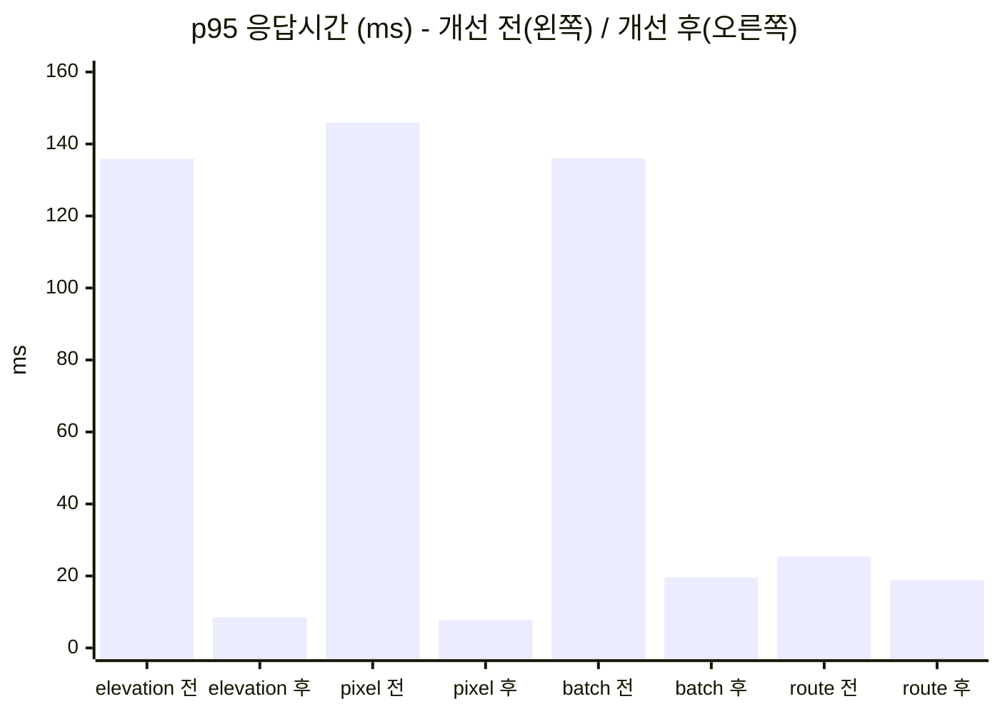

# 테스트 결과 비교 분석

> 대상: geo-gdal-service (공간 데이터 수집·검수·가공·배포 파이프라인 + 공간 조회·경로탐색 API)
> 기간: 2026-09-24 ~ 09-25
> 관련 문서: [테스트 계획](TEST_PLAN.md)

---

## 1. 요약

| 구분 | 결과 |
|---|---|
| 기능 (JUnit) | 74 → **81개 전부 통과** (성능 개선에 대한 테스트 7개 추가) |
| 기능 (시스템 E2E) | 1차 **46/47** → 결함 수정 후 **47/47**, 이후 연속 4회 통과 |
| 테스트로 찾은 결함 | 기능·안정성 결함 **4건** (모두 수정), 성능 결함 **1건** (수정), 측정 방법 결함 **3건** (수정) |
| 성능 개선 (래스터 조회) | 고도 p95 **135.9 → 8.5ms (-94%)**, 픽셀 p95 **145.9 → 7.8ms (-95%)** |
| 성능 개선 (경로·POI) | 변화가 측정 잡음 범위 안이라 **개선을 주장하지 않음** |
| 알고리즘 | A\* 는 Dijkstra 대비 확정 노드 **43~47%**, 600쌍에서 최적 비용 불일치 **0건** |

가장 중요한 결론은 두 가지다.

1. **실제 성능 결함은 1건이었다.** 1차 측정에서 임계값을 넘은 3건 중 고도·픽셀 조회만 결함이었다. POI KNN 은 재현되지 않았다. 경로 API 는 지연의 대부분이 실행 환경의 네트워크 비용이었다.
2. **측정이 틀릴 수 있다는 것 자체가 가장 큰 발견이었다.** 한 차례는 오류 응답이 19% 섞였는데도 성능이 좋아 보였다. 이후 오류율 검사, 데이터 가용성 확인, 반복 측정을 측정 절차에 넣었다.

---

## 2. 테스트 환경과 방법

### 2.1 환경

| 항목 | 내용 |
|---|---|
| 호스트 | Windows 11, Docker Desktop (WSL2), 22 코어 |
| 애플리케이션 | Docker 이미지 (GDAL 3.6.3 + OpenJDK 17), 단일 인스턴스 |
| DB / 스토리지 | PostGIS 16-3.4 / LocalStack 3.8 (S3) - 같은 Docker 네트워크 |
| 부하 발생기 | k6 1.6.1 (호스트에서 실행 → `localhost:8080` 포트 포워딩) |
| 성능 데이터 | 도로망 100×100 격자 (노드 10,000 / 링크 19,800), POI 20,000건, DEM 400×400 (EPSG:5186, 30m) |

> 부하 발생기와 서버가 같은 PC 에 있고 Windows → WSL2 포트 포워딩을 거친다. 따라서 절대값보다 **같은 조건에서 비교한 상대값**에 의미가 있다.

### 2.2 측정 회차

| 회차 | 방법 | 요청 수 | 오류율 | 유효 여부 |
|---|---|---|---|---|
| ① 1차 측정 | 단발, 10 VU × 20초, 워밍업 없음 | 61,780 | 0.0% | 유효 (단, 반복하지 않은 1회) |
| ② 재측정 | 단발, 10 VU × 20초 | 124,881 | **19.1%** | ❌ 무효 - S3 객체 소실 후 측정 |
| ③ 개선 전 기준 측정 (1차 시도) | 워밍업 + 3회 | 58,190 (1회차) | **15.6%** | ❌ 무효 - 같은 원인 |
| ④ **A/B 비교** | 워밍업 + 3회 중앙값, 이미지 교체 | 이미지별 3회 × 8종 × 15초 | 0.0% / 최대 0.018% | ✅ 유효 - 이 문서의 기준 |
| ⑤ 풀 스트레스 | 30 VU × 30초 (래스터 3종) | 248,258 | 0.0% | ✅ 유효 |

②와 ③에서는 E2E 의 스토리지 장애 시나리오(TC-FT-02)가 LocalStack 을 재시작했다. 이때 S3 에 있던 COG 파일이 사라졌고, 이후 고도·픽셀 요청은 503 을 받았다. 503 은 몇 ms 만에 돌아오기 때문에 **평균 응답시간이 오히려 좋아졌다.** (→ 6.2)

### 2.3 A/B 비교 방법 (회차 ④)

```
개선 전 커밋(aa258e7) 이미지 ─┐                         ┌─ 워밍업 5초 (결과 버림)
                              ├─ 같은 PostGIS/S3 데이터 ─┼─ 15초 × 3회 측정
개선 후 커밋(64ac099) 이미지 ─┘   (prepare.py 로 확인)   └─ API 별 p50/p95 의 중앙값
```
- 두 이미지를 같은 컨테이너 이름·포트·네트워크로 차례로 띄워서 **코드 외의 조건을 같게** 했다.
- 측정 전에 `prepare.py` 가 각 데이터셋을 실제로 조회해 보고, 조회가 안 되면 다시 적재한다.
- `bench.py` 는 시나리오별 오류율이 0.1% 를 넘으면 그 측정을 무효로 처리한다.
- **판정 기준:** 개선 전·후 3회 측정값의 범위(최소~최대)가 **겹치지 않을 때만** 개선이라고 판단한다.

---

## 3. 기능 테스트 결과 비교

### 3.1 테스트 규모 변화

| 레벨 | 초기 | 테스트 단계 후 | 성능 개선 후 |
|---|---|---|---|
| 단위 (외부 의존 없음) | 49 | 49 | 53 (`ActiveVersionResolverTest` +4) |
| 통합 (PostGIS·S3·GDAL) | 25 | 25 | 28 (`RasterHandlePoolGdalTest` +3) |
| **JUnit 합계** | **74** | **74** | **81** |
| 시스템 E2E 시나리오 | - | 47 | 47 |

### 3.2 E2E 회차별 결과

| 회차 | 결과 | 비고 |
|---|---|---|
| 1 | 46 / 47 | TC-DS-03 실패: 요청 본문의 잘못된 enum 값에 500 응답 |
| 2 | 47 / 47 | 수정 후 |
| 3 | 47 / 47 | `run-system-tests.sh` 일괄 실행 검증 |
| 4 | 47 / 47 | 성능 개선(캐시·풀) 적용 후 회귀 확인 |

그룹별 소요 시간 (4회차, 총 약 89초)

| 그룹 | 시나리오 | 소요 | 비고 |
|---|---|---|---|
| 환경 / 데이터셋 | 5 | 1.1s | |
| 래스터 / 벡터 | 14 | 7.7s | 파이프라인(업로드→검수→가공→배포) 포함 |
| 배포 / 조회 / 경로 | 24 | 5.8s | |
| 동시성 | 2 | 9.1s | 배포 전환 중 경로 요청 1,880건, 오류 0 |
| 장애 | 2 | 65.0s | 컨테이너 재시작·LocalStack 재기동 대기가 대부분 |

### 3.3 테스트 레벨별로 찾은 결함

| 결함 | 찾은 레벨 | 단위·통합에서 못 찾은 이유 |
|---|---|---|
| 잘못된 enum 값 → 500 (400 이어야 함) | E2E | 통합 테스트는 올바른 요청 위주. 실제 HTTP 본문 역직렬화 오류 경로를 호출하지 않았음 |
| S3 장애 → 409 Conflict (503 이어야 함) | E2E 설계 | 통합 테스트의 LocalStack 은 항상 정상. 장애를 주입하는 테스트가 없었음 |
| S3·GDAL HTTP 타임아웃 없음 (장애 시 무기한 대기) | E2E 설계 | 위와 같음 |
| DEM 재배포 중 그래프 로드 경쟁 조건 | E2E 설계 | 단일 스레드 테스트로는 시점이 겹치는 상황을 만들 수 없음 |
| 래스터 조회마다 COG 열기 (p95 136ms) | 성능 | 기능은 정상이라 기능 테스트로는 드러나지 않음 |

단위·통합 테스트는 **"정상 입력에서 올바르게 동작하는가"** 에 강하다. 실제 배포 환경의 E2E·장애·성능 테스트는 **"잘못된 입력, 인프라 장애, 동시 실행, 부하에서 어떻게 동작하는가"** 를 찾아냈다. 두 종류가 서로 다른 결함을 잡았다.

---

## 4. 성능 비교 (A/B, 회차 ④)

### 4.1 API 별 결과 (단위 ms, 10 VU, 3회 중앙값)

| API | 개선 전 p50 / p95 | 개선 후 p50 / p95 | p95 변화 | 개선 전 p95 범위 | 개선 후 p95 범위 | 판정 |
|---|---|---|---|---|---|---|
| elevation | 21.2 / 135.9 | 3.9 / 8.5 | **-94%** | 117.3 ~ 169.8 | 7.8 ~ 13.6 | ✅ 개선 |
| pixel_value | 24.1 / 145.9 | 3.6 / 7.8 | **-95%** | 120.7 ~ 155.4 | 6.6 ~ 13.9 | ✅ 개선 |
| elevation_batch (100점) | 24.2 / 136.0 | 7.1 / 19.6 | **-86%** | 121.2 ~ 149.5 | 17.8 ~ 27.5 | ✅ 개선 |
| route_astar | 9.4 / 25.4 | 6.5 / 18.9 | -26% | 20.6 ~ 28.5 | 16.6 ~ 23.0 | ➖ 범위 겹침 |
| route_dijkstra | 8.7 / 21.5 | 8.7 / 28.3 | +32% | 20.8 ~ 25.2 | 13.9 ~ 30.6 | ➖ 범위 겹침 |
| route_walk | 7.2 / 18.7 | 6.1 / 16.2 | -14% | 17.7 ~ 35.4 | 15.9 ~ 31.6 | ➖ 범위 겹침 |
| poi_nearby | 9.1 / 24.1 | 12.9 / 32.8 | +36% | 16.3 ~ 32.0 | 23.8 ~ 39.4 | ➖ 코드 변경 없음 |
| poi_nearest | 5.7 / 11.8 | 7.5 / 19.7 | +67% | 9.8 ~ 46.1 | 15.1 ~ 24.1 | ➖ 코드 변경 없음 |



### 4.2 3회 측정값 원본 (p50 / p95, ms)

| API | 개선 전 1 | 개선 전 2 | 개선 전 3 | 개선 후 1 | 개선 후 2 | 개선 후 3 |
|---|---|---|---|---|---|---|
| elevation | 17.9 / 117.3 | 39.0 / 169.8 | 21.2 / 135.9 | 4.5 / 13.6 | 3.9 / 8.5 | 3.5 / 7.8 |
| pixel_value | 24.1 / 145.9 | 30.1 / 155.4 | 18.5 / 120.7 | 4.7 / 13.9 | 3.4 / 6.6 | 3.6 / 7.8 |
| elevation_batch | 22.2 / 121.2 | 35.8 / 149.5 | 24.2 / 136.0 | 8.1 / 27.5 | 7.1 / 17.8 | 6.4 / 19.6 |
| route_astar | 10.1 / 28.5 | 7.8 / 20.6 | 9.4 / 25.4 | 8.4 / 23.0 | 6.5 / 18.9 | 6.2 / 16.6 |
| route_dijkstra | 8.6 / 21.5 | 10.2 / 25.2 | 8.7 / 20.8 | 10.1 / 28.3 | 6.2 / 13.9 | 8.7 / 30.6 |
| route_walk | 7.2 / 18.7 | 13.4 / 35.4 | 6.9 / 17.7 | 9.5 / 31.6 | 6.1 / 16.2 | 6.0 / 15.9 |
| poi_nearby | 9.1 / 24.1 | 13.5 / 32.0 | 8.1 / 16.3 | 12.9 / 32.8 | 13.4 / 39.4 | 9.5 / 23.8 |
| poi_nearest | 5.7 / 11.8 | 14.9 / 46.1 | 5.1 / 9.8 | 9.3 / 24.1 | 7.5 / 19.7 | 6.6 / 15.1 |

### 4.3 부하를 높였을 때 (회차 ⑤, 개선 후, 30 VU × 30초)

| API | p50 | p95 | p99 |
|---|---|---|---|
| elevation | 8.0 | 25.0 | 50.1 |
| pixel_value | 5.7 | 11.4 | 17.6 |
| elevation_batch | 19.2 | 43.9 | 65.6 |

- 처리량 **약 2,640 req/s**, 248,258건 중 오류 0건. 앱 로그에도 ERROR·WARN 이 없었다.
- 동시 사용자를 3배로 늘려도 개선 후 p95(최대 43.9ms)가 **개선 전 10 VU 의 p95(136ms)보다 낮다.**
- 풀 크기(경로당 최대 16개)를 넘는 동시 요청에서도 오류 없이 새 핸들을 열어 처리했다.

---

## 5. 항목별 원인 분석

### 5.1 고도·픽셀 조회 (#6) - 결함 확인, 수정

**가설:** 요청마다 S3 의 COG 를 여는 비용이 대부분이다.

**근거**

| 관찰 | 해석 |
|---|---|
| 고도 1점 조회 p50 ≈ 100점 배치 조회 p50 (21.2 vs 24.2ms) | 좌표가 100배여도 시간은 비슷함. 좌표별 계산이 아니라 **요청당 고정 비용**이 지배적 |
| 배치 조회는 래스터를 요청당 한 번 연다 | 고정 비용 = 래스터 열기 |
| `/vsis3/` 열기 = S3 HEAD + 헤더 Range GET + GeoTransform 역변환 + 좌표 변환 객체 생성 | 매 요청 네트워크 왕복 2회 이상과 PROJ 초기화 |

**조치:** 버전별 COG 경로 단위로 **열린 핸들 풀**(`RasterHandlePool`)을 두었다.
- GDAL Dataset 은 스레드 안전하지 않으므로 한 핸들은 한 요청에만 빌려준다.
- 가장 최근에 반납된 핸들부터 다시 빌려준다(LIFO). 그래서 블록 캐시가 이미 채워진 핸들을 재사용하게 된다.
- 새 버전이 배포되면 이전 경로의 핸들을 닫는다. 롤백되면 다시 풀에 넣는다.

**결과:** p95 **-94~95%**. 3회 범위가 겹치지 않는다. 풀 사용 후 단건 조회(3.9ms)가 배치 조회(7.1ms)보다 빨라졌다. 요청당 고정 비용이 사라지고 좌표 수에 비례하는 비용만 남았다.

### 5.2 POI KNN (#5) - 결함 아님으로 정정

1차 측정의 p95 447ms 는 오류가 없던 유효한 측정이었다. 그래서 이 값을 원인 분석의 출발점으로 삼았다.

| 단계 | 측정 | 결론 |
|---|---|---|
| 1 | `psql -c` 로 geography KNN 실행: 16.6ms, geometry KNN: 1.7ms | 처음엔 "geography KNN 이 느리다"고 판단 |
| 2 | 같은 세션에서 워밍업 후 반복: geography KNN **0.2~0.7ms** | 16.6ms 는 **새 커넥션의 첫 geography 연산 초기화 비용**이었음. 쿼리 자체는 빠름 |
| 3 | JDBC generic plan 을 강제한 `PREPARE/EXECUTE` 로 실행: 0.36ms, GiST 인덱스 사용 | 실행 계획도 정상 |
| 4 | 대안(geometry KNN 으로 반경 상한 → geography 반경 검색) 실행: 0.7~1.6ms | 대안이 오히려 느려서 **적용하지 않음** |
| 5 | 앱 재시작 직후(콜드) / 워밍업 후 측정: p95 24.5 / 13.1ms | 콜드 스타트로도 447ms 는 설명되지 않음 |
| 6 | 이후 10회 측정 p95: 9.8 ~ 46.1ms | **447ms 는 한 번도 재현되지 않음** |

**결론:** 코드 결함이 아니다. 1차 측정 때의 일시적 요인으로 보이지만, 무엇이었는지 특정하지 못했다. 후보는 직전 E2E 의 컨테이너 재시작, 대량 적재 직후의 백그라운드 작업이다. 원인을 모르는 채로 "결함 없음"이라고 단정하지 않고, **미재현 이상치**로 기록한다.

### 5.3 경로 API (#7) - 수정했지만 효과는 주장하지 않음

**처음 가설:** 경로 응답 12ms 중 탐색은 1~2ms 이고, 나머지는 요청당 DB 조회와 직렬화다.

**실행 환경의 기본 지연 측정 (10 VU)**

| 요청 | p50 | 포함된 작업 |
|---|---|---|
| 짧은 경로 (인접 노드) | 5.1ms | HTTP + active 버전 DB 조회 + 탐색(거의 0) + 직렬화 |
| 긴 경로 (격자 임의 쌍) | 7.7ms | 위 + 탐색 1~2ms + 긴 geometry 직렬화 |
| 서버 측 탐색 시간만 (`elapsedMs`) | 0.98ms (A\*) | 탐색 |

지연의 대부분(약 5ms)은 **Windows → WSL2 포트 포워딩을 포함한 요청 왕복 비용**이다. DB 조회는 그중 일부에 불과하다. 따라서 DB 조회를 없애도 개선 폭은 작을 수밖에 없고, 측정 결과도 잡음 범위 안이었다.

**그래도 유지한 이유:** `ActiveVersionResolver` 는 조회 요청마다 하던 DB 조회를 없앴다.
- DB 부하가 줄어든다.
- 짧은 DB 장애 동안에도 경로탐색·고도 조회가 계속 동작한다.
- 배포 커밋 직후 캐시를 즉시 무효화하므로 E2E 버전 전환 시나리오(TC-RT-05, TC-CC-02)의 정확성이 유지된다. 1,880건 요청 중 버전과 결과가 어긋난 응답은 0건이었다.

---

## 6. 측정 신뢰성 분석

### 6.1 측정 잡음의 크기

같은 코드·같은 조건에서 3회 반복했을 때 p95 의 범위 폭(최대 - 최소)을 중앙값 대비 비율로 계산했다.

| API | 개선 전 | 개선 후 |
|---|---|---|
| route_dijkstra | 20% | 59% |
| route_astar | 31% | 34% |
| poi_nearby | 65% | 48% |
| route_walk | 94% | 97% |
| poi_nearest | **309%** | 46% |

**20~97%, 최대 309%** 로 흔들렸다. 이 환경에서 단발 측정으로 수십 % 의 차이를 개선이나 저하라고 판단하면 틀릴 가능성이 높다. 이 문서가 "범위가 겹치지 않는 경우만 개선"이라는 보수적인 기준을 쓴 이유다.

잡음의 원인으로 추정되는 것:
- 부하 발생기와 서버가 같은 PC 의 CPU 를 나눠 씀
- Windows → WSL2 네트워크 경유
- 짧은 측정 시간(15초)에서 JVM GC 한 번의 영향이 큼

### 6.2 무효 측정 사례: 오류 응답이 성능을 좋아 보이게 함

| 회차 | 고도 p95 | 오류율 | 겉보기 해석 | 실제 |
|---|---|---|---|---|
| ① 1차 | 155.3ms | 0% | 느림 | 실제로 느림 (A/B 개선 전 135.9ms 와 일치) |
| ② 재측정 | **50.3ms** | **19.1%** | "다시 재니 괜찮다" | 고도·픽셀 요청의 상당수가 즉시 503 |
| ④ A/B 개선 전 | 135.9ms | 0% | 느림 | ①과 일치 → ①이 옳았음 |

②만 보고 "1차 측정은 일시적 문제였다"고 결론 내릴 뻔했다. 실제로 중간 보고에서 그렇게 잘못 보고했다가 정정했다.

**재발 방지 조치**

| 조치 | 위치 |
|---|---|
| 시나리오별 실패율을 기록하고 임계값 설정 | `scripts/perf/load-test.js` |
| 오류율 0.1% 초과 측정은 무효 처리, 종료 코드 1 | `scripts/perf/bench.py` |
| 측정 전에 실제 조회로 데이터 가용성을 확인하고 필요하면 재적재 | `scripts/perf/prepare.py` |
| 장애 시나리오 뒤에 성능 측정을 할 때 위 확인을 반드시 거치도록 실행 순서 고정 | `scripts/run-system-tests.sh` |

### 6.3 확인하지 못한 것

| 항목 | 상태 |
|---|---|
| 1차 측정의 POI KNN 447ms | 미재현, 원인 미특정 (5.2) |
| A/B 개선 후 1회차 pixel_value 요청 1건 실패 (0.018%) | 로그 보존 전에 컨테이너를 정리해 원인 미확인. 이후 30 VU 스트레스 248,258건에서 오류 0건, 재현 안 됨 |

---

## 7. 알고리즘 비교: Dijkstra vs A\*

### 7.1 두 가지 측정

| 측정 | 방법 | 결과 |
|---|---|---|
| 단위 테스트 | 40×40 무작위 격자(등급·속도·일방통행 무작위), 600 질의 | 확정 노드 A\* / Dijkstra = **62.7%**, 비용 전부 일치 |
| 서버 측 벤치마크 | 100×100 격자, `/api/routes/compare`, 무작위 400쌍(CAR) + 200쌍(WALK) | 확정 노드 **47% (CAR) / 43% (WALK)**, 비용 불일치 **0건** |

### 7.2 거리 구간별 (서버 측, CAR)

| 직선거리 | 쌍 | 확정 노드 Dijkstra → A\* | 비율 | 탐색 시간 p50 Dijkstra → A\* |
|---|---|---|---|---|
| 0 ~ 2km | 29 | 441 → 131 | 30% | 0.12 → 0.07ms |
| 2 ~ 5km | 147 | 3,321 → 1,075 | 32% | 0.87 → 0.57ms |
| 5 ~ 20km | 224 | 7,028 → 3,629 | 52% | 1.92 → 1.67ms |
| 전체 | 400 | 5,188 → 2,437 | 47% | 1.43 → 0.98ms |

**분석**
- **짧은 거리에서 효과가 크다 (30%).** Dijkstra 는 출발지 주변을 원형으로 넓혀 가지만, A\* 는 목적지 방향으로 치우쳐 탐색한다.
- **긴 거리에서는 효과가 줄어든다 (52%).** 이 격자의 경계 때문이다. 목적지가 멀면 Dijkstra 의 탐색 원도 격자 경계에 막혀 더 커지지 못한다. 그래서 두 알고리즘의 탐색량 차이가 줄어든다. 전체 노드가 10,000개라 Dijkstra 도 최대 10,000개를 넘을 수 없다.
- **노드 수 감소만큼 시간이 줄지는 않는다** (노드 47% vs 시간 69%). A\* 는 노드마다 하버사인 거리(삼각함수)를 계산한다. 그래서 노드당 비용이 Dijkstra 보다 크다.
- **HTTP 부하 테스트에서는 Dijkstra 가 더 빨라 보였다.** 탐색 시간(1~2ms)이 요청 전체(7~10ms)에서 차지하는 비중이 작고 측정 잡음이 커서 생긴 착시다. 알고리즘 비교는 서버 측 탐색 시간으로 해야 한다.

### 7.3 최적성 검증

A\* 휴리스틱은 "직선거리 / 이동수단 최대 속도"다. 실제 비용을 과대평가하지 않으므로 최적해를 보장해야 한다. 이를 세 가지로 확인했다.
- 단위 테스트: Bellman-Ford 결과와 Dijkstra 결과 대조
- 단위 테스트: 무작위 격자 600 질의에서 Dijkstra 와 A\* 비용 비교
- 서버 측: 실제 도로망 600쌍(CAR 400 + WALK 200)에서 비교

**모두 불일치 0건.**

---

## 8. 공간 인덱스: 격자 인덱스 vs 전수 탐색

| 조건 | 격자 인덱스 | 전수 탐색 | 배수 |
|---|---|---|---|
| 점 100,000개, 최근접 1,000 질의 | 16.9ms | 9,668.5ms | **약 570배** |

- 정확성: 점 20,000개에 질의 2,000건(범위 밖 질의 포함)을 해서 전수 탐색과 결과가 같음을 확인했다. 반경 검색 200건도 같다.
- 경로탐색에서 좌표를 가장 가까운 도로 노드에 붙이는 데(스냅) 이 인덱스를 쓴다. 전수 탐색은 점 10만 개에서 질의당 약 10ms 가 걸린다. 도로망이 커질수록 이 비용이 경로 탐색 시간(1~2ms)보다 커지므로 인덱스가 필요하다.

---

## 9. 한계와 다음 단계

| 한계 | 영향 | 다음 단계 |
|---|---|---|
| 부하 발생기와 서버가 같은 PC, WSL2 경유 | 잡음 20~97%, 10% 단위 차이 판별 불가 | 리눅스 서버에서 부하 발생기를 분리해 재측정 |
| 측정 3회, 15초 | 통계적 유의성이 약함 | 5회 이상, 60초 측정 |
| 합성 데이터(격자) | 실제 도로망의 불균일한 밀도·연결을 반영하지 못함 | 국가표준노드링크, OSM(교차로 분할 전처리 필요) 적재 후 측정 |
| 단일 인스턴스 | 다중 인스턴스에서의 캐시 일관성(TTL 5초 구간)을 검증하지 못함 | 인스턴스 2개 + 한쪽 배포 시나리오 추가 |
| 미재현 이상치 2건 | 원인 미특정 | 측정 시 앱·DB 로그와 컨테이너 자원 사용량을 함께 보존 |
